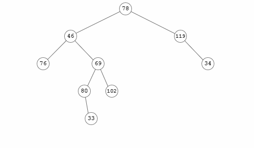

# prettybt

string to visual binary tree.

### todo

- handle sparse wide/deep trees better; find a way to squish 'em
- add horizontal/vertical output support
- generate array for random tree to input box
